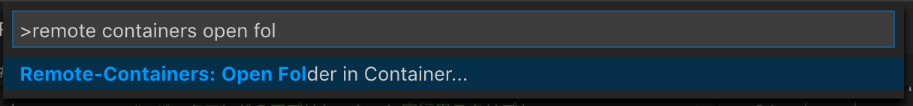

# bbs
This is a sample project for technical learning of back-end engineers.
The theme is a bulletin board system (like 5ch).

## Getting Started
``` sh
# 本番設定 (productionモード) で実行
$ make run

# テスト
$ make test
```

## Developing inside a Container
1. Build development image
   ``` sh
   $ make build_dev
   ```
2. Start VS Code.
3. Run the **Remote-Containers: Open Folder in Container...** command from the Command Palette, and select this project folder.

